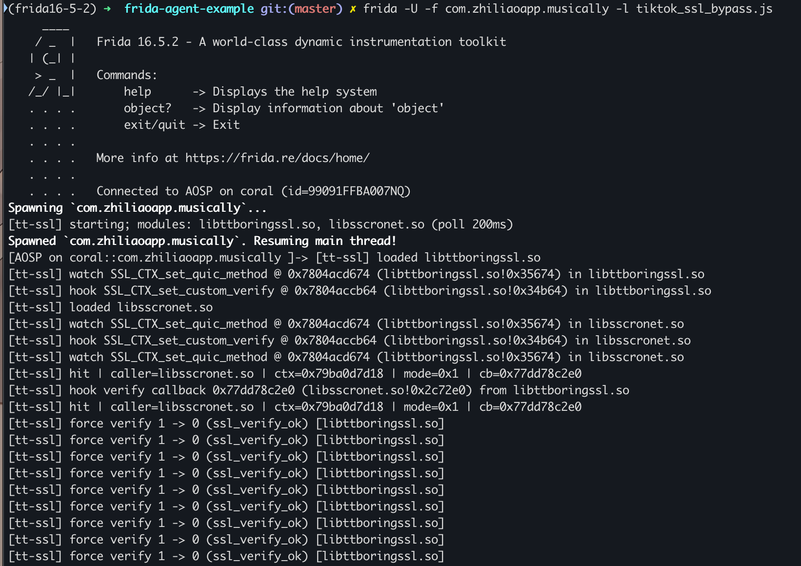
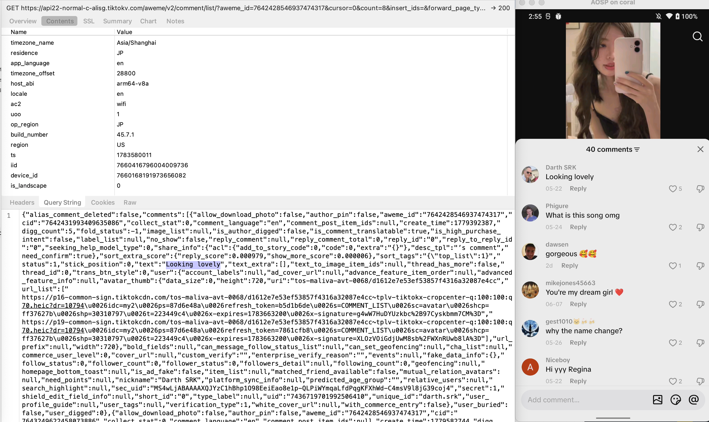
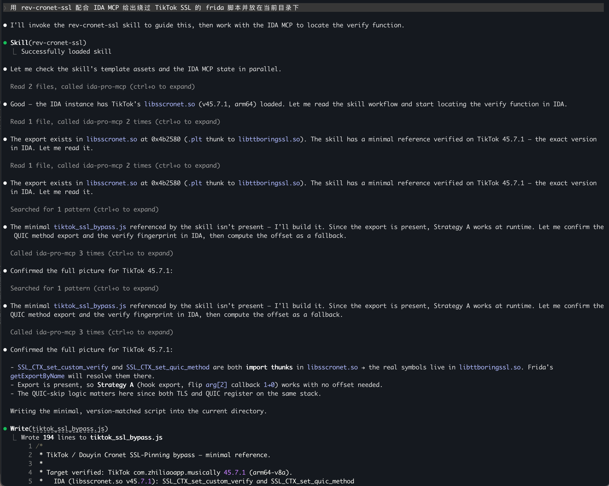

# tiktok-ssl-bypass-skill

> A [Claude Code](https://docs.claude.com/en/docs/claude-code) skill to bypass **Cronet / BoringSSL** SSL pinning in TikTok, Douyin, and other ByteDance apps — pairs with **Frida + IDA MCP** to generate version-specific bypass scripts.

中文: [README.md](README.md)

---

## ⚠️ Disclaimer

For **authorized security testing, protocol analysis, and education only** (your own device, your own traffic, CTF, sanctioned pentests). You are responsible for complying with all applicable laws. Do not use for any commercial or illegal purpose. The author assumes no liability.

---

**Core idea:** In `SSL_CTX_set_custom_verify(ctx, mode, callback)`, the third argument `callback` is the app's own verifier, returning `ssl_verify_result_t` (`0=ok / 1=invalid / 2=retry`). Use `Interceptor.attach` and in the callback's `onLeave` flip **only** a hard failure `1 → 0` (leave the async `2/retry` untouched, never replace the callback) — this bypasses pinning without desyncing Cronet's state machine.

```
Java API → JNI → Cronet C API → Chromium net stack → BoringSSL (SSL_CTX_set_custom_verify)
```

Full reversing workflow: [`skills/rev-cronet-ssl/SKILL.md`](skills/rev-cronet-ssl/SKILL.md)

---

## Contents

| File | Description |
|------|-------------|
| `skills/rev-cronet-ssl/SKILL.md` | The skill: activation triggers, detection theory, **IDA MCP workflow**, bypass decision tree |
| `skills/rev-cronet-ssl/assets/tiktok_ssl_bypass.js` | **The bypass script** — verified on TikTok `45.7.1`, also covers Douyin and other Cronet apps. Resolves the symbol in the app's own BoringSSL (rejects the system `libssl.so`), polling + dlopen detection, skips QUIC callbacks, dedupes by address, flips only `1→0`; includes an offset fallback and a backtrace debug switch. |

> Most public scripts hook `android_dlopen_ext` to wait for the `.so` to load — but **newer ByteDance builds use bytehook/custom loaders, so that hook never fires** and the script silently fails. This script **polls** for the module instead, avoiding this pitfall.

---

## Quick start

### Prerequisites

- Rooted Android device / emulator with your proxy CA trusted
- `frida-server` (or gadget) on device, `frida` tools on PC
- An intercepting proxy (mitmproxy / Charles / BurpSuite)

### Run (TikTok example)

```bash
# local USB uses -U; forward to a networked frida-server with -H host:port
# Must spawn (-f): the SSL_CTX is built early, attaching late misses the hook
frida -U -f com.zhiliaoapp.musically \
      -l skills/rev-cronet-ssl/assets/tiktok_ssl_bypass.js

# Douyin (same script)
frida -U -f com.ss.android.ugc.aweme \
      -l skills/rev-cronet-ssl/assets/tiktok_ssl_bypass.js
```

Hook installed after running:



### Success output

```
[tt-ssl] hook SSL_CTX_set_custom_verify @ 0x... (libttboringssl.so!0x34b64) in libttboringssl.so
[tt-ssl] hit | caller=libsscronet.so | ctx=0x... | mode=0x1 | cb=0x...
[tt-ssl] force verify 1 -> 0 (ssl_verify_ok) [libttboringssl.so]
[tt-ssl] skip: QUIC ctx 0x... (async retry callback, leave native)
```

Once you see `force verify 1 -> 0` and traffic flows in your proxy, the bypass works.

### Result

Charles captures the app's traffic:



---

## Use as a Claude Code skill

With [IDA Pro MCP](https://github.com/mrexodia/ida-pro-mcp), Claude can drive the whole loop: load the `.so` → locate `SSL_CTX_set_custom_verify` → confirm the verify callback → compute the offset → emit a version-specific script.

Install (symlink the skill into your project's `.claude/skills/`):

```bash
git clone https://github.com/Zskkk/tiktok-ssl-bypass-skill.git
ln -s "$(pwd)/tiktok-ssl-bypass-skill/skills/rev-cronet-ssl" \
      /path/to/your-project/.claude/skills/rev-cronet-ssl
```

Then ask Claude: "use rev-cronet-ssl with IDA MCP to produce a Frida script that bypasses TikTok SSL and put it in the current directory."



---

## Scope

| App | Package | Primary module |
|-----|---------|----------------|
| TikTok | `com.zhiliaoapp.musically` | `libsscronet.so` |
| Douyin | `com.ss.android.ugc.aweme` | `libsscronet.so` |

TikTok and Douyin share the same protocol stack (only offsets differ by build). For geo-restricted TikTok: remove the SIM, set device locale/timezone overseas, route the IP overseas.

---

## License

[MIT](LICENSE)
